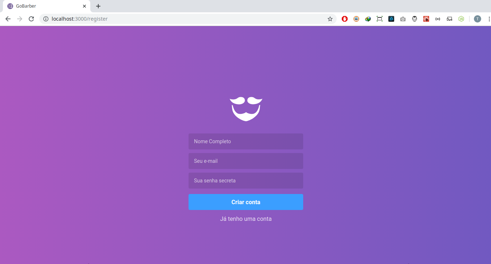
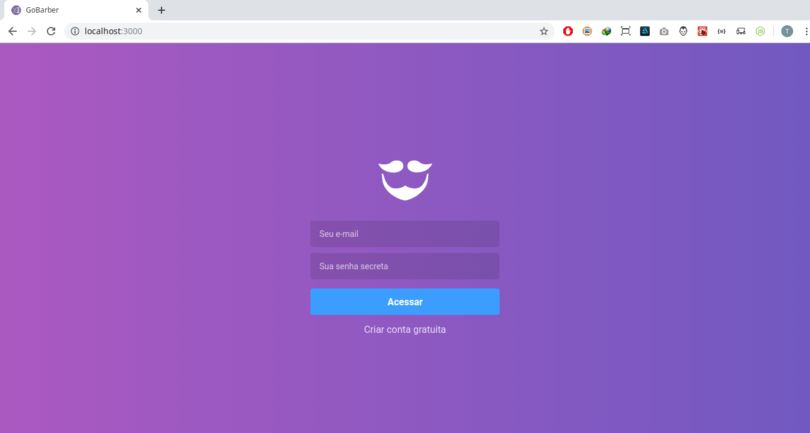
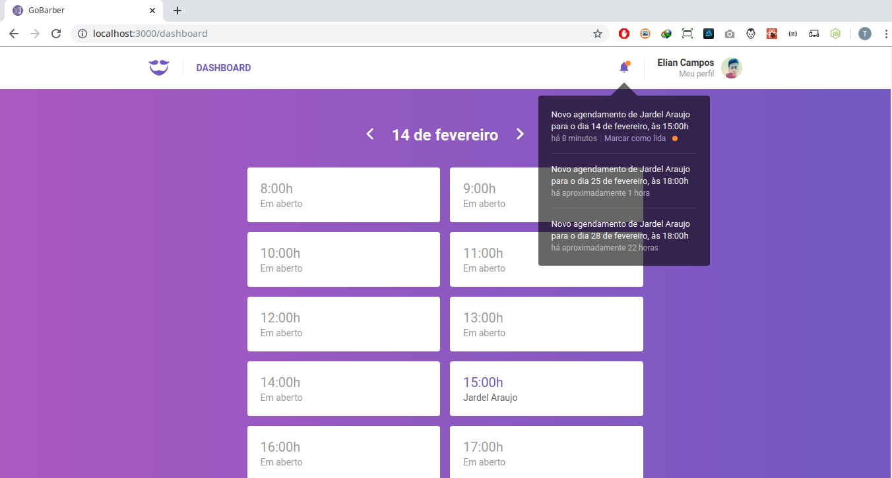
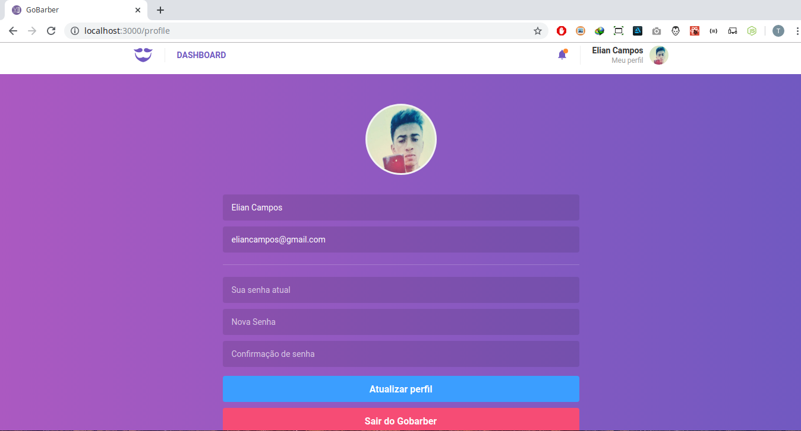
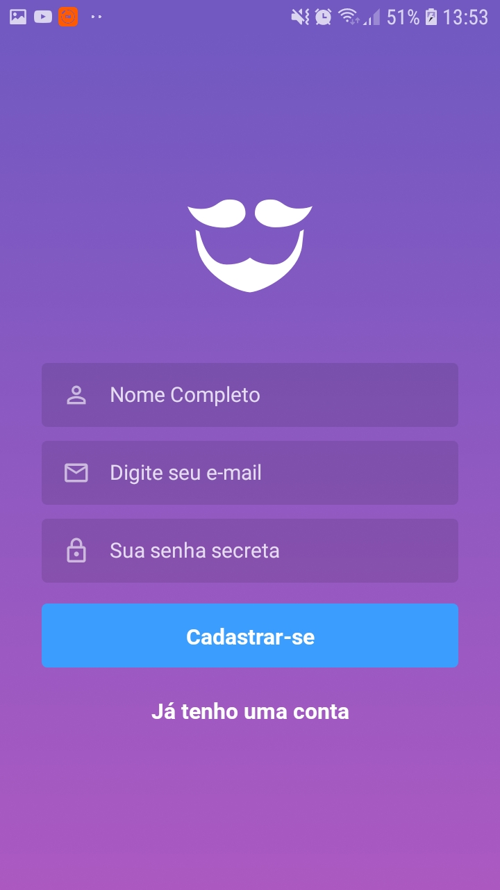
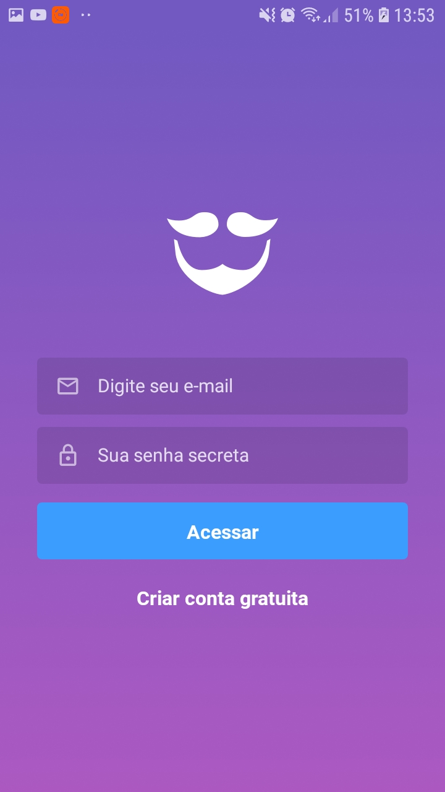
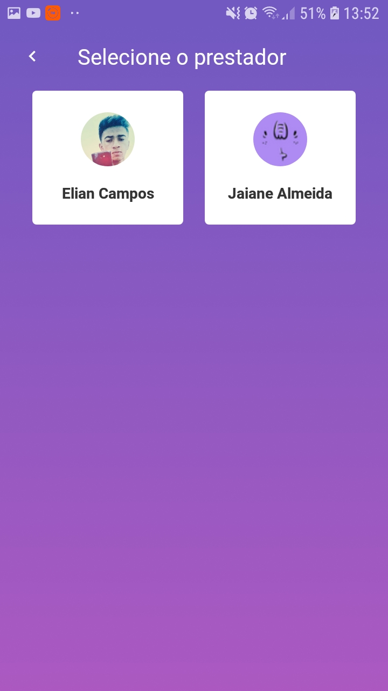
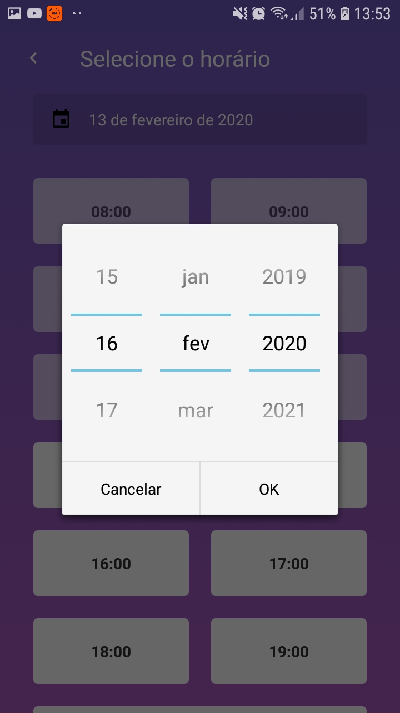
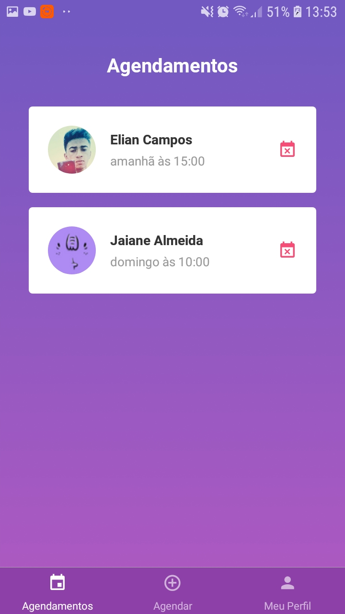
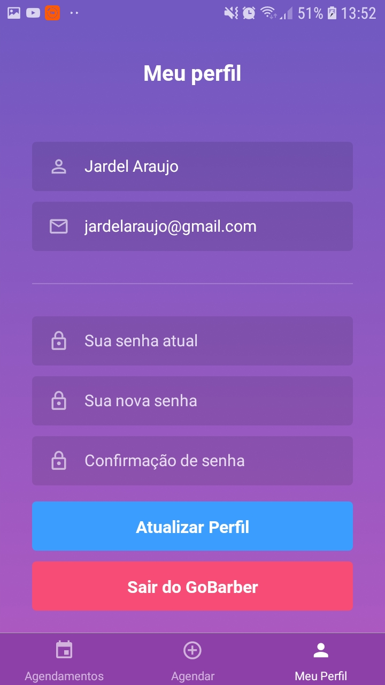

# GoBarber

Aplicação Web e Mobile onde clientes podem marcar agendamentos com cabeleireiros. <br/>

GoBarber na parte Web o dono do salão faz o cadastro e automaticamente é cadastrado como provedor de serviços. Ao se cadastrar automaticamente poderá fazer o login na plataforma. <br/>

 <br/>

 <br/>

Ao fazer login o cabeleireiro ver quais as pessoas que marcaram agendamento em tal horário. Agendamentos estão disponíveis apenas para horários que ainda não passaram, onde no dashboard mostra um tom mais escuro indicando que aquele horário já passou. <br/>
A cada agendamento feito o cabeleireiro receberá uma notificação, dizendo qual pessoa, a data marcada, e há quanto tempo se passou desde que aquela pessoa fez o agendamento. <br/>

 <br/>

Na plataforma também é possível fazer a troca de avatar, nome, senha e etc...Além de claro podendo sair plataforma. <br/>

 <br/>

Na parte mobile será onde os clientes se cadastrarão de poderá fazer login, onde verá quais os prestadores estão cadastrado na plataforma. <br/>

 <br/>

! <br/>

 <br/>

Ao escolher um prestador, através de um Date Picker o cliente poderá escolher a data e o horário que deseja ir ao salão. <br/>

 <br/>

 <br/>

Quando confirmar seu agendamento, a notificação será mandada automaticamente para o cabeleireiro como já citado, e o cliente poderá ver todos os seus agendamentos, com seu cabeleireiro escolhido, horário e etc. <br/>
O agendamento que passar do horário automaticamente ficará indisponivel para o cliente. E também há possibilidade do mesmo cancelar tal agendamento, na qual automaticamente é mandado um email para o cabeleireiro dizendo que o cliente cancelou tal agendamento. <br/>

 <br/>

O usuário também poderá alterar seus dados como nome, senha e etc..<br/>

 <br/>

## Tecnologias Usadas

Todo o projeto foi construído com Node.Js, ReactJS e React Native. Foi usando o Banco de Dados Postgres para cadastro de clientes, agendamentos e etc. <br/>
MongoDB onde fica todas notificações e sistema de fila com o Redis para emails, onde usei o NodeMailer além de várias outras bibliotecas incluindo Redux e Redux Sagas para React e React Native. <br/>

## Instalação

Dê um git clone no projeto em qualquer pasta de sua preferência. Antes de tudo você deverá ter os servidores para os banco de dados Postgres, MongoDB e Redis. Após isso, vá em cada pasta backend, frontend e mobile e dê um:

```sh
yarn install ou npm install
```

Para instalar as dependências.
Após isso inicie o backend com o comando:

```sh
yarn dev
```

Depois abra outra aba no seu terminal e dê um:

```sh
yarn queue
```

Após isso basta ir na pasta frontend e dê um:

```sh
yarn start
```

E na parte mobile:

```sh
react-native run-android ou run-ios
```

Depois:

```
react-native start
```
